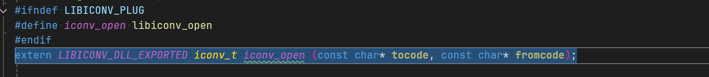
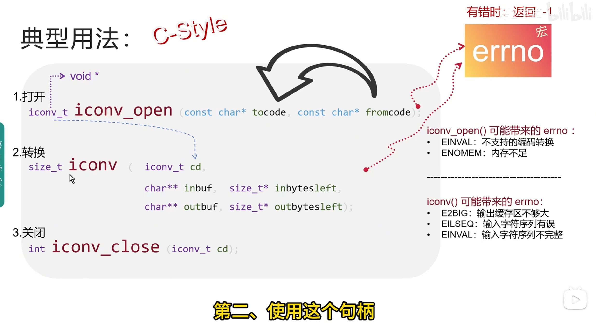

# UTF-8

从 NT4 开始，Windows 基于 Unicode 编码的字符串，是的。早期版本基于 UCS-2，它是 UTF-16 的前身，因此不支持 UTF-16 支持的所有字符。更高版本基于 UTF-16。但是，并非所有作系统都基于 UTF-16/UCS-2。例如，*nix 系统基于 UTF-8

**UTF-8 是持久存储数据的非常好的选择。它是所有 Unicode 环境中普遍支持的编码，并且在数据大小和无损数据兼容性之间取得了很好的平衡。**

***std::wstring***在技术上是 UCS-2 (每个字符使用两个字节)，代码表*主要*映射到 Unicode 格式。**重要的是要了解 UCS-2 与 UTF-16 不同！**UTF-16 允许使用“代理对”来表示超出双字节范围的字符，但 UCS-2 对每个字符（句点）只使用两个字节。

# MultiByteToWideChar()

[传送门](https://learn.microsoft.com/en-us/windows/win32/api/stringapiset/nf-stringapiset-widechartomultibyte)

**函数功能**：该函数映射一个字符串到一个宽字符（unicode）的字符串。由该函数映射的字符串没必要是多字节字符组。

~~~c
int WideCharToMultiByte(
  [in]            UINT                               CodePage,
  [in]            DWORD                              dwFlags,
  [in]            _In_NLS_string_(cchWideChar)LPCWCH lpWideCharStr,
  [in]            int                                cchWideChar,
  [out, optional] LPSTR                              lpMultiByteStr,
  [in]            int                                cbMultiByte,
  [in, optional]  LPCCH                              lpDefaultChar,
  [out, optional] LPBOOL                             lpUsedDefaultChar
);
~~~

## Parameters CodePage

执行转换时使用的代码页。此参数可以设置为作系统中已安装或可用的任何代码页的值

| Value         | Description                                                  |
| ------------- | ------------------------------------------------------------ |
| CP_ACP        | 系统默认的 Windows ANSI 代码页。                             |
| CP_MACCP      | 当前系统 Macintosh 代码页(通常不需要，                       |
| CP_OEMCP      | 当前系统 OEM 代码页                                          |
| CP_SYMBOL     | 元件代码页                                                   |
| CP_THREAD_ACP | 当前线程的 Windows ANSI 代码页                               |
| CP_UTF7       | UTF-7 的 UTF 格式。仅当 7 位传输机制强制使用时，才使用该值。最好使用 UTF-8。 |
| CP_UTF8       | UTF-8  代码                                                  |

## Parameters dwFlags [in]

指示转换类型的标志。应用程序可以指定以下值的组合，其中 **MB_PRECOMPOSED** 是默认值。**MB_PRECOMPOSED** 和 **MB_COMPOSITE** 是互斥的。**MB_USEGLYPHCHARS** 和 **MB_ERR_INVALID_CHARS** 可以设置，而不管其他标志的状态如何。

| 价值                     | 意义                                                         |
| :----------------------- | :----------------------------------------------------------- |
| **MB_COMPOSITE**         | 始终使用分解字符，即基本字符和一个或多个非空格字符各自具有不同码位值的字符。例如，Ä 用 A + ̈ 表示：拉丁文大写字母 A （U+0041） + 组合 DIAERESIS （U+0308）。请注意，此标志不能与 MB_PRECOMPOSED 一起使用。 |
| **MB_ERR_INVALID_CHARS** | 如果遇到无效的输入字符，则失败。  从 Windows Vista 开始，如果应用程序未设置此标志，则函数不会删除非法代码点，而是使用 U+FFFD （编码为指定的代码页） 替换非法序列。  **Windows 2000 SP4 及更高版本、Windows XP：**如果未设置此标志，该函数会以静默方式删除非法代码点。调用 [GetLastError](https://learn.microsoft.com/en-us/windows/win32/api/errhandlingapi/nf-errhandlingapi-getlasterror) 将返回 ERROR_NO_UNICODE_TRANSLATION。 |

# WideCharToMultiByte

# wstring

[wstring](https://content.helpme-codesys.com/en/CODESYS%20Development%20System/_cds_datatype_wstring.html)

[csdn](https://blog.csdn.net/weixin_42711661/article/details/130930638#:~:text=%E6%96%87%E7%AB%A0%E4%BB%8B%E7%BB%8D%E4%BA%86C%2FC%2B%2B%E4%B8%AD%E4%BD%BF%E7%94%A8iconv%E7%B3%BB%E5%88%97%E5%87%BD%E6%95%B0%E8%BF%9B%E8%A1%8C%E5%AD%97%E7%AC%A6%E7%BC%96%E7%A0%81%E8%BD%AC%E6%8D%A2%E7%9A%84%E6%96%B9%E6%B3%95%EF%BC%8C%E5%8C%85%E6%8B%ACiconv_open%E3%80%81iconv%E5%92%8Ciconv_close%E4%B8%89%E4%B8%AA%E4%B8%BB%E8%A6%81%E5%87%BD%E6%95%B0%E7%9A%84%E4%BD%BF%E7%94%A8%EF%BC%8C%E4%BB%A5%E5%8F%8A%E8%BD%AC%E6%8D%A2%E8%BF%87%E7%A8%8B%E4%B8%AD%E7%9A%84%E5%8F%82%E6%95%B0%E8%AF%B4%E6%98%8E%E5%92%8C%E9%94%99%E8%AF%AF%E5%A4%84%E7%90%86%E3%80%82%20%E7%A4%BA%E4%BE%8B%E4%BB%A3%E7%A0%81%E5%B1%95%E7%A4%BA%E4%BA%86%E5%A6%82%E4%BD%95%E5%9C%A8UTF-8%E5%92%8CGBK%E7%BC%96%E7%A0%81%E9%97%B4%E8%BF%9B%E8%A1%8C%E8%BD%AC%E6%8D%A2%E3%80%82%20%E5%9C%A8%E6%AD%A4%E5%A4%84%E5%8F%AF%E4%BB%A5%E7%9C%8B%E5%88%B0%20iconv%20%28%29%E7%B3%BB%E5%88%97%20%E5%87%BD%E6%95%B0,%E7%9A%84man%E6%89%8B%E5%86%8C%20iconv%20%283%29%20-%20Linux%20manual%20page)

https://stackoverflow.com/questions/14148814/c-using-of-iconv-on-windows-with-mingw-compiler

https://www.gnu.org/savannah-checkouts/gnu/libiconv/documentation/libiconv-1.18/iconv.3.html

https://www.gnu.org/savannah-checkouts/gnu/libiconv/documentation/libiconv-1.18/iconvctl.3.html

https://www.gnu.org/savannah-checkouts/gnu/libiconv/documentation/libiconv-1.18/iconv_open_into.3.html


https://man7.org/linux/man-pages/man3/iconv.3.html

https://blog.csdn.net/weixin_42711661/article/details/130930638


https://github.com/dawnfrost/iconv-dir/blob/b59b41e29899f098b0338e730f76ddb8e929567d/src/main.cpp


# wstring

根据 IEC 61131-3 标准，数据类型遵循 UCS-2 编码。`WSTRING`

```c
typedef basic_string<wchar_t> wstring;
```


# iconv



~~~c
size_t iconv （iconv_t cd、const char* * inbuf、size_t * inbytesleft、
char* * outbuf、size_t * outbytesleft);
~~~

inbytesleft:  inbytes 大小 

输入输出不是1:1 无关系



return -1 错误 ;errno

iconv()` 函数将一个字符编码的字符序列转换为另一个字符编码的字符序列。`cd` 参数是一个转换描述符

，由先前对 `iconv_open(3)` 的调用创建；该转换描述符定义了 `iconv()` 在转换过程中使用的字符编码。`inbuf` 参数是一个变量的地址，该变量指向输入序列的第一个字符；

`inbytesleft` 表示该缓冲区中的字节数。

`outbuf` 参数是一个变量的地址，该变量指向输出缓冲区中可用的第一个字节；

`outbytesleft` 表示输出缓冲区中可用的字节数。

主要的情况是当 inbuf 不为 NULL 且 *inbuf 不为 NULL 时。
在这种情况下，iconv() 函数会将从 *inbuf 开始的多字节序列转换为从 *outbuf 开始的多字节序列。
最多会读取从 *inbuf 开始的 *inbytesleft 个字节。最多会写入从 *outbuf 开始的 *outbytesleft 个字节。

`iconv()` 函数一次转换一个多字节字符，对于每个字符转换，它会将 `*inbuf` 增加，并将 `*inbytesleft` 减去已转换的输入字节数，将 `*outbuf` 增加，并将 `*outbytesleft` 减去已转换的输出字节数，同时更新 `cd` 中包含的转换状态。如果输入的字符编码是有状态的，`iconv()` 函数还可以将输入字节序列转换为转换状态的更新而不产生任何输出字节；这种输入称为移位序列。转换可以因五种原因停止：

- 输入中遇到无效的多字节序列。在本例中，它将errno设置为EILSEQ并返回(size_t) -1。*inbuf左指向无效多字节序列的开头。

- 遇到一个多字节序列，该序列有效但无法转换为输出的字符编码。这种情况取决于实现和转换描述符。在GNU C库和GNU libiconv中，如果`cd`创建时没有使用后缀`//TRANSLIT`或`//IGNORE`，则转换是严格的：有损转换会产生这种情况。如果指定了后缀`//TRANSLIT`，则在某些情况下可以通过音译避免这种情况。在musl C库中，这种情况不会发生，因为会使用转换为`'*'`作为回退。在FreeBSD、NetBSD和Solaris的`iconv()`实现中，这种情况也不会发生，因为它们会使用转换为`'?'`作为回退。当满足此条件时，`iconv()`会将`errno`设置为`EILSEQ`并返回`(size_t) -1`。`*inbuf`会指向无法转换的多字节序列的开头。
- 输入的字节序列已经完全转换，即`*inbytesleft`已减少到0。在这种情况下，`iconv()`会返回在此次调用期间执行的非可逆转换的次数。
- 在输入中遇到了一个不完整的多字节序列，并且输入字节序列在其后终止。在这种情况下，`iconv()`会将`errno`设置为`EINVAL`并返回`(size_t) -1`。`*inbuf`会指向不完整多字节序列的开头。

- 输出缓冲区没有足够的空间来容纳下一个转换后的字符。在这种情况下，`iconv()`会将`errno`设置为`E2BIG`并返回`(size_t) -1`

- 另一种情况是当`inbuf`为`NULL`或`*inbuf`为`NULL`，但`outbuf`不为`NULL`且`*outbuf`不为`NULL`时。在这种情况下，`iconv()`函数会尝试将`cd`的转换状态设置为初始状态，并在`*outbuf`处存储相应的移位序列。从`*outbuf`开始，最多会写入`*outbytesleft`字节。如果输出缓冲区没有足够的空间来存储此重置序列，它会将`errno`设置为`E2BIG`并返回`(size_t) -1`。否则，它会根据写入的字节数增加`*outbuf`并减少`*outbytesleft`。

  第三种情况是当`inbuf`为`NULL`或`*inbuf`为`NULL`，且`outbuf`为`NULL`或`*outbuf`为`NULL`时。在这种情况下，`iconv()`函数会将`cd`的转换状态设置为初始状态。

- `iconv()`函数返回在此次调用期间以不可逆方式转换的字符数量；可逆转换不会被计数。如果发生错误，`iconv()`会返回`(size_t) -1`，并设置`errno`以指示具体的错误

  

  

## errro code

**E2BIG**
`*outbuf`处没有足够的空间。

**EILSEQ**
在输入中遇到了无效的多字节序列。

**EINVAL**
在输入中遇到了不完整的多字节序列。

**ENOMEM**

内存不足

 

## attention

在每次调用`iconv()`的系列操作中，最后一次调用应将`inbuf`或`*inbuf`设置为`NULL`，以便刷新任何部分转换的输入。

尽管`inbuf`和`outbuf`的类型为`char **`，但这并不意味着它们所指向的对象可以被解释为C字符串或字符数组：字符字节序列的解释由转换函数内部处理。在某些编码中，零字节可能是多字节字符的有效部分。

`iconv()`的调用者必须确保传递给函数的指针适合访问相应字符集中的字符。这包括在对齐要求严格的平台上确保正确的对齐。